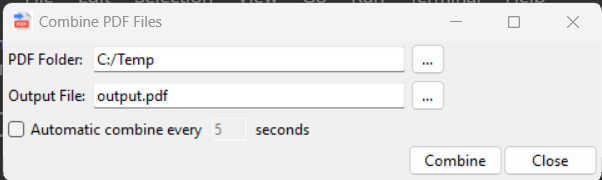

# CombinePDFs
Combine multiple PDFs into a single file.

## System Requirements

Python 3.10.x

### 3rd Party Python Packages
1. [pypdf](https://pypi.org/project/pypdf/)
2. [pyinstaller](https://pypi.org/project/pyinstaller/)
3. tkinter

## Usage

### Command line Parameters


### Windows GUI



## Create Executable

To build executable:

1. Open Python command window.
2. cd to this folder.
3. Run the following
```pyinstall --onefile combine.py```
